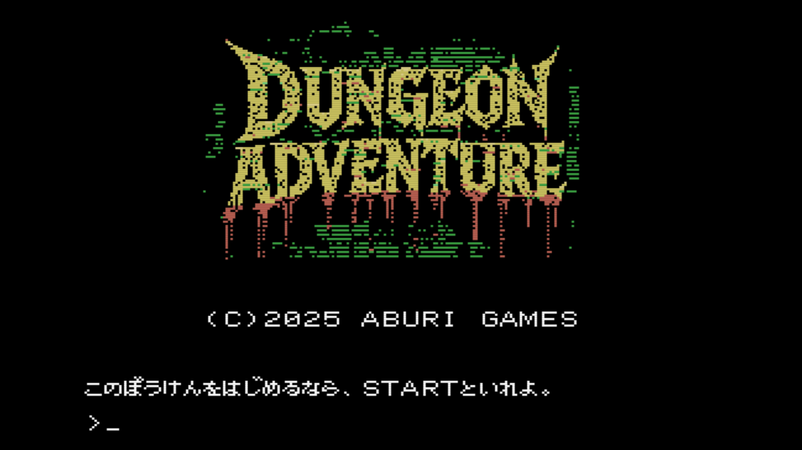

[ [Engligh](README.md) | 日本語 ]

---
# Dungeon Adventure for MSX



<br>

## オンラインプレイ

[Play on WebMSX](https://webmsx.org/?MACHINE=MSX1J&ROM=https://github.com/aburi6800/msx-advtest/raw/refs/heads/main/dist/advtest.rom&ROM_FORMAT=ASCII16&FAST_BOOT)

<br>

## 概要

- キーボードからコマンドを入力して進める、レトロスタイルなアドベンチャーゲームです。  
  ダンジョンから脱出することが目的です。  
- コマンドは英語で、動詞＋名詞のように入力してください。  
  例：LOOK ROOM、OPEN DOOR  
- 移動する際は、方向をFORWARD（前）、BACK（後ろ）、左（LEFT）、右（RIGHT）で指定してください。  
  先頭1文字だけでも受け付けます。  
  例：GO FORWARD、LEFT、R  

<br>

## ビルド方法

z88dkとcmakeが必要です。あらかじめインストールしておいてください。  
プロジェクトのクローンを作成し、プロジェクトのルートフォルダに入り、以下を実行します。  

```
$ mkdir build && cd build
$ cmake -DCMAKE_TOOLCHAIN_FILE=../cmake/z88dk.cmake ..
$ make clean && make
```

プロジェクトの `dist` ディレクトリに `advtest.rom` ファイルが出力されます。  

<br>

## エミュレータで実行する

各エミュレータで実行する際は、スロット1に `advtest.rom` ファイルを、マッパ―にASCII16を指定してください。

<br>

## ライセンス

- Dungeon Adventure  
  Copyright (c) 2025 aburi6800 (Hitoshi Iwai)

  Permission is hereby granted, free of charge, to any person obtaining a copy of this software and associated documentation files (the “Software”), to deal in the Software without restriction, including without limitation the rights to use, copy, modify, merge, publish, distribute, sublicense, and/or sell copies of the Software, and to permit persons to whom the Software is furnished to do so, subject to the following conditions:

  The above copyright notice and this permission notice shall be included in all copies or substantial portions of the Software.

  THE SOFTWARE IS PROVIDED “AS IS”, WITHOUT WARRANTY OF ANY KIND, EXPRESS OR IMPLIED, INCLUDING BUT NOT LIMITED TO THE WARRANTIES OF MERCHANTABILITY, FITNESS FOR A PARTICULAR PURPOSE AND NONINFRINGEMENT. IN NO EVENT SHALL THE AUTHORS OR COPYRIGHT HOLDERS BE LIABLE FOR ANY CLAIM, DAMAGES OR OTHER LIABILITY, WHETHER IN AN ACTION OF CONTRACT, TORT OR OTHERWISE, ARISING FROM, OUT OF OR IN CONNECTION WITH THE SOFTWARE OR THE USE OR OTHER DEALINGS IN THE SOFTWARE.

<br>

- Pletter v0.5b - XL2S Entertainment 2008  
  Copyright (c) 2002-2003 Team Bomba  

  Permission is hereby granted, free of charge, to any person obtaining a copy of this software and associated documentation files (the “Software”), to deal in the Software without restriction, including without limitation the rights to use, copy, modify, merge, publish, distribute, sublicense, and/or sell copies of the Software, and to permit persons to whom the Software is furnished to do so, subject to the following conditions:

  The above copyright notice and this permission notice shall be included in all copies or substantial portions of the Software.

  THE SOFTWARE IS PROVIDED "AS IS", WITHOUT WARRANTY OF ANY KIND, EXPRESS OR IMPLIED, INCLUDING BUT NOT LIMITED TO THE WARRANTIES OF MERCHANTABILITY, FITNESS FOR A PARTICULAR PURPOSE AND NONINFRINGEMENT. IN NO EVENT SHALL THE AUTHORS OR COPYRIGHT HOLDERS BE LIABLE FOR ANY CLAIM, DAMAGES OR OTHER LIABILITY, WHETHER IN AN ACTION OF CONTRACT, TORT OR OTHERWISE, ARISING FROM, OUT OF OR IN CONNECTION WITH THE SOFTWARE OR THE USE OR OTHER DEALINGS IN THE SOFTWARE.

<br>

## Thanks

- [Z88DK - The Development Kit for Z80 Computers](https://github.com/z88dk/z88dk)
- [C-BIOS](http://cbios.sourceforge.net/)
- [openMSX](https://openmsx.org/)
- [MSXPen](https://msxpen.com/)
- [画像変換 for MSX/MSX2/MSX2+](https://nazo.main.jp/prog/retropc/gcmsx.html)
- [Pletter](https://xl2s.tk/)
- [ChatGPT](https://chatgpt.com/)
- [Gemini](https://gemini.google.com/app)
- [Grok](https://x.com/i/grok)
