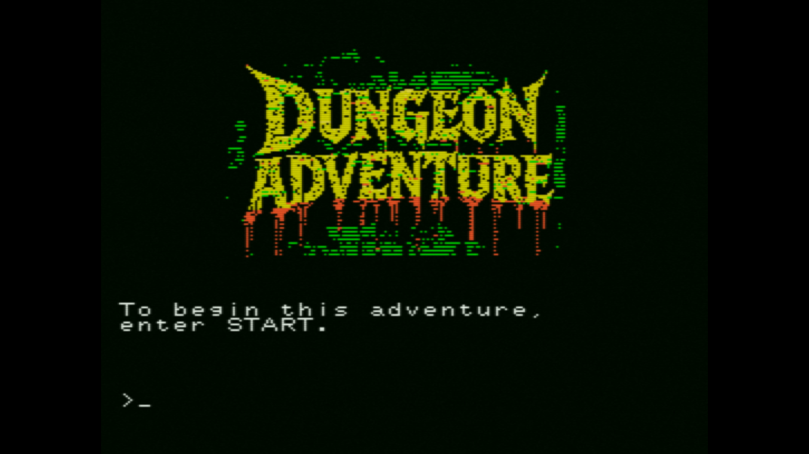

[ Engligh | [日本語](README.ja.md) ]

---
# Dungeon Adventure for MSX



<br>

## Online Play

[Play on WebMSX](https://webmsx.org/?MACHINE=MSX1A&ROM=https://github.com/aburi6800/msx-advtest/raw/refs/heads/main/dist/advtest.rom&ROM_FORMAT=ASCII16&FAST_BOOT)

<br>

## Overview

- A retro-style adventure game played by entering commands from the keyboard.  
  The objective is to escape from the dungeon by overcoming numerous ordeals.  
- Commands are entered in English, verb + noun.  
  Example : LOOK ROOM、OPEN DOOR  
- When moving, specify the direction as FORWARD (front), BACK (back), LEFT (left), or RIGHT (right).  
  Only the first letter is acceptable.  
  Example : GO FORWARD、LEFT、R  
- Note that you can confirm the above explanation by putting `HELP` in the game.  

<br>

## How to Build

Requires z88dk and cmake.  
Clone the project, go into the root folder of the project and do the following:  

```
$ mkdir build && cd build
$ cmake -DCMAKE_TOOLCHAIN_FILE=../cmake/z88dk.cmake ..
$ make clean && make
```

The file `advtest.rom` is created in the `dist` directory of the project.  

<br>

## Running on the emulator

When running on each emulator, specify the `advtest.rom` file in slot 1 and ASCII16 in the mapper.  

<br>

## License

- Dungeon Adventure  
  Copyright (c) 2025 aburi6800 (Hitoshi Iwai)

  Permission is hereby granted, free of charge, to any person obtaining a copy of this software and associated documentation files (the “Software”), to deal in the Software without restriction, including without limitation the rights to use, copy, modify, merge, publish, distribute, sublicense, and/or sell copies of the Software, and to permit persons to whom the Software is furnished to do so, subject to the following conditions:

  The above copyright notice and this permission notice shall be included in all copies or substantial portions of the Software.

  THE SOFTWARE IS PROVIDED “AS IS”, WITHOUT WARRANTY OF ANY KIND, EXPRESS OR IMPLIED, INCLUDING BUT NOT LIMITED TO THE WARRANTIES OF MERCHANTABILITY, FITNESS FOR A PARTICULAR PURPOSE AND NONINFRINGEMENT. IN NO EVENT SHALL THE AUTHORS OR COPYRIGHT HOLDERS BE LIABLE FOR ANY CLAIM, DAMAGES OR OTHER LIABILITY, WHETHER IN AN ACTION OF CONTRACT, TORT OR OTHERWISE, ARISING FROM, OUT OF OR IN CONNECTION WITH THE SOFTWARE OR THE USE OR OTHER DEALINGS IN THE SOFTWARE.

<br>

- Pletter v0.5b - XL2S Entertainment 2008  
  Copyright (c) 2002-2003 Team Bomba  

  Permission is hereby granted, free of charge, to any person obtaining a copy of this software and associated documentation files (the “Software”), to deal in the Software without restriction, including without limitation the rights to use, copy, modify, merge, publish, distribute, sublicense, and/or sell copies of the Software, and to permit persons to whom the Software is furnished to do so, subject to the following conditions:

  The above copyright notice and this permission notice shall be included in all copies or substantial portions of the Software.

  THE SOFTWARE IS PROVIDED "AS IS", WITHOUT WARRANTY OF ANY KIND, EXPRESS OR IMPLIED, INCLUDING BUT NOT LIMITED TO THE WARRANTIES OF MERCHANTABILITY, FITNESS FOR A PARTICULAR PURPOSE AND NONINFRINGEMENT. IN NO EVENT SHALL THE AUTHORS OR COPYRIGHT HOLDERS BE LIABLE FOR ANY CLAIM, DAMAGES OR OTHER LIABILITY, WHETHER IN AN ACTION OF CONTRACT, TORT OR OTHERWISE, ARISING FROM, OUT OF OR IN CONNECTION WITH THE SOFTWARE OR THE USE OR OTHER DEALINGS IN THE SOFTWARE.

<br>

## Thanks

- [Z88DK - The Development Kit for Z80 Computers](https://github.com/z88dk/z88dk)
- [C-BIOS](http://cbios.sourceforge.net/)
- [openMSX](https://openmsx.org/)
- [MSXPen](https://msxpen.com/)
- [Image converter for MSX/MSX2/MSX2+](https://nazo.main.jp/prog/retropc/gcmsx.html)
- [Pletter](https://xl2s.tk/)
- [ChatGPT](https://chatgpt.com/)
- [Gemini](https://gemini.google.com/app)
- [Grok](https://x.com/i/grok)
